# Instalação e configuração do ambiente Flutter

Este guia tem por objetivo ensinar a instalar, configurar e executar um app desenvolvido com o *Framework Flutter* diretamente pelo Windows, utilizando também o editor de código Microsoft VS Code. Todas as etapas foram separadas em seções, visando facilitar o entendimento de cada procedimento para que este processo pudesse ser realizado em etapas e com tranquilidade.

Versão: 1.0.0.

**Sumário**

- [Instalação e configuração do ambiente Flutter](#instalação-e-configuração-do-ambiente-flutter)
  - [Habilitando a virtualização com Hyper-V no Windows](#habilitando-a-virtualização-com-hyper-v-no-windows)
  - [Instalação e Configuração do Android Studio](#instalação-e-configuração-do-android-studio)
  - [Criação e configuração da AVD](#criação-e-configuração-da-avd)
  - [Instalação e configuração do Framework Flutter](#instalação-e-configuração-do-framework-flutter)
  - [Instalação e configuração do Microsoft Visual Studio Code](#instalação-e-configuração-do-microsoft-visual-studio-code)
  - [Testando um app em Flutter com VS Code](#testando-um-app-em-flutter-com-vs-code)

## Habilitando a virtualização com Hyper-V no Windows

Para que a depuração das aplicações possam ser realizadas na AVD (Android Virtual Device), é necessário que a **virtualização esteja habilitada na BIOS (AMD-V ou Intel VT-x)**. 


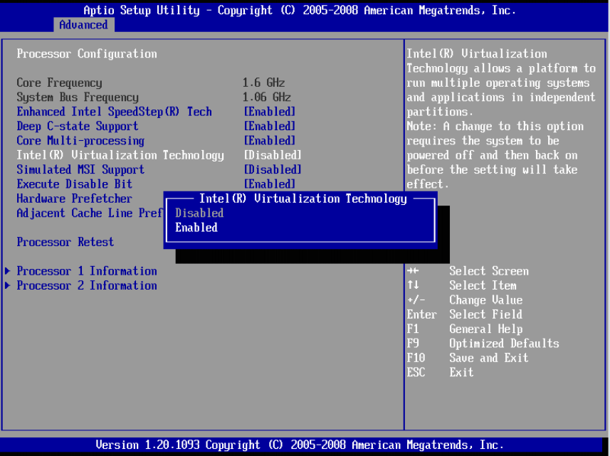

Em seguida, será necessário habilitar a tecnologia Hyper-V para que a tecnologia AVD possa funcionar corretamente no Windows.

1. Abra o **Painel de Controle** e acesse a opção **Desinstalar um programa**:

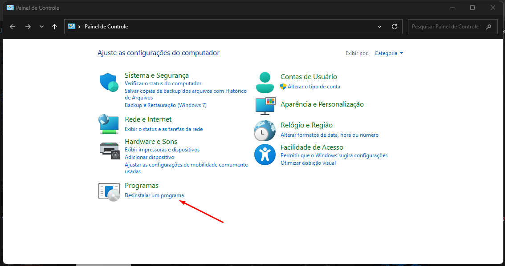

2. No canto direito da tela, acesse a opção Ativar ou desativar recursos do Windows:

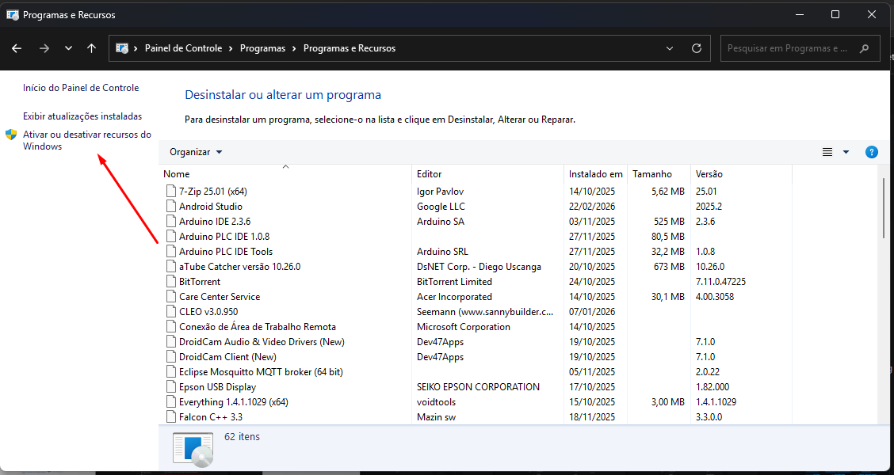

3. Busque pela opção **Plataforma de Máquina Virtual** ou **Hyper-V** e habilite a opção:

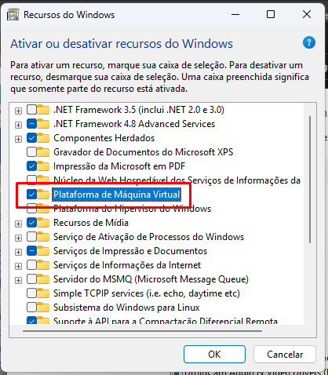

1. Aguarde as configurações serem aplicadas e reinicie o computador:

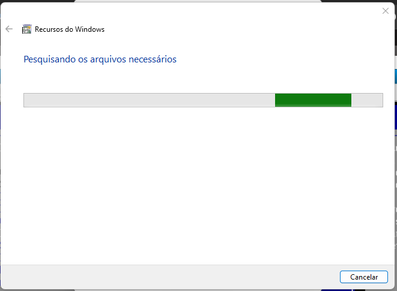

Após a reinicialização do computador, seguiremos com a instalação e configuração do *Android Studio*.

---

## Instalação e Configuração do Android Studio

Embora não utilizaremos o Android Studio como ferramenta de programação, é necessária sua instalação, pois somente é possível obter o Android SDK através do instalador do Android Studio. Além disso, recursos importantes para a depuração, como a AVD, somente estão disponíveis através desta IDE.

1. Baixe o instalador do Android Studio através do link [https://developer.android.com/studio?hl=pt-br](https://developer.android.com/studio?hl=pt-br).

2. Após o download, inicie a instalação e habilite a opção ***Android Virtual Device***, disponível em *Choose Components*:

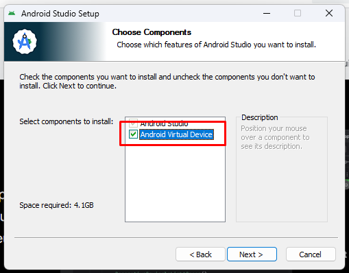

3. Siga com a instalação, indicando o caminho mais adequado (O padrão é *C:\Program Files\Android\Android Studio*) e clique em **Install**:

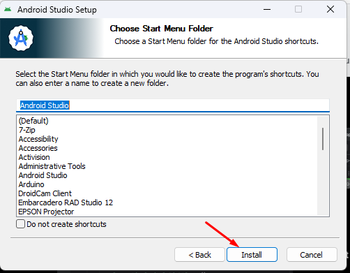

4. Após a conclusão da instalação, clique em *Finish* e **Inicie o Android Studio**.

5. Na janela de boas vinda do *Android Studio*, clique em ***More Actions*** e em seguida ***SDK Manager***:

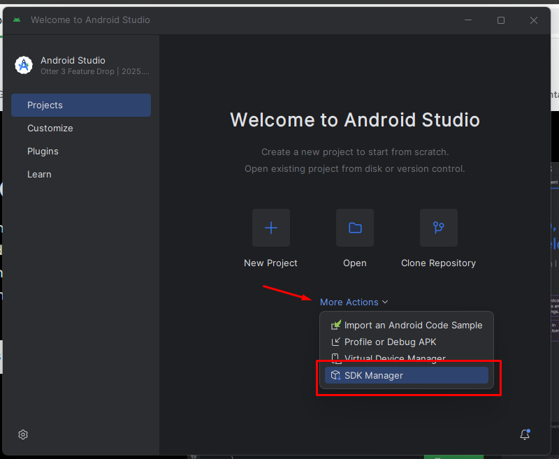

6. Na aba ***SDK Platforms***, habilite as seguintes opções:

|Name                    |API Level|
|------------------------|---------|
|Android 16.0 ("Baklava")|36.0     |
|Android 10 ("Q")        |29       |
|Android 9.0 ("Pie")     |28       |

7. Em SDK Tools, habilite com ✅ as seguintes opções:

|Name|Version|
|---|---|
|Android SDK Build-Tools||
|Android SDK Command-line Tools (latest)||
|Android Emulator|36.2.12^|
|Android Emulator hypervisor driver (installer)|2.2.0^|
|Android SDK Platform-Tools|36.0.0^|
|Google USB Driver|13^|
|Google Web Driver|2^|

8. Clique em ***Apply** e confirme para iniciar a instalação das dependências necessárias.
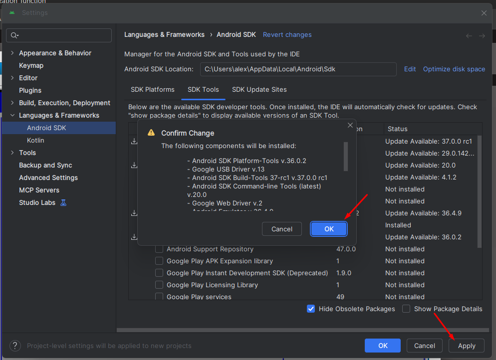

9. O processo de instalação deverá acontecer dentro de alguns minutos. Após isso, clique em ***Finish***.


As configurações no SDK Tools estão finalizadas. A partir de agora, será necessário realizar a criação e a configuração das AVDs (Android Virtual Device).

## Criação e configuração da AVD

As AVDs são necessárias para emular dispositivos Android diretamente no computador, semelhante ao que acontece com programas de máquinas virtuais (Hyper-V, Virtual Box, etc).

|Nome|Imagem|
|---|---|
|Small Phone|Android 16.0 ("Baklava")||

Para realizar a criação das AVDs, siga estes passos:

1. Na janela de boas-vindas do Android Studio, clique em More Actions e posteriormente em ***Virtual Device Manager***:

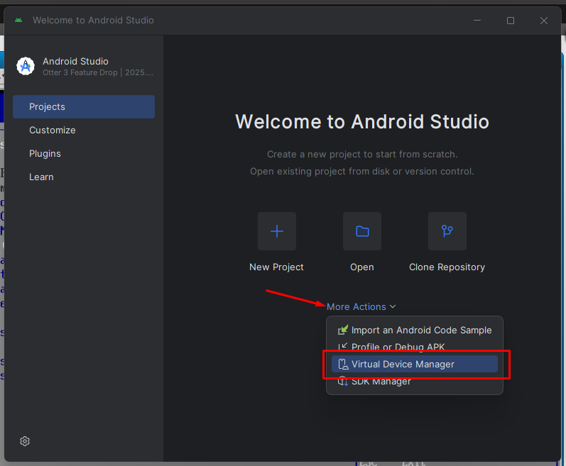

2. Na janela *Device Manager*, clique no botão **+** ou em ***Create virtual device***:
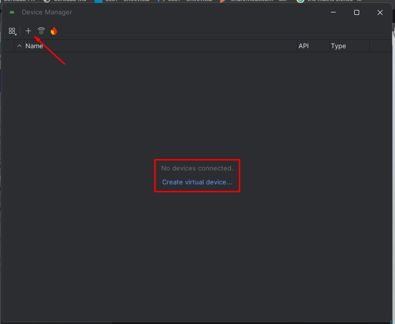

3. Na janela a seguir, selecione qual o formato do display ou tipo de dispositivo da AVD. Utilizaremos dois formatos durante a aulas: ***Small Phone*** e ***Pixel 9a***.

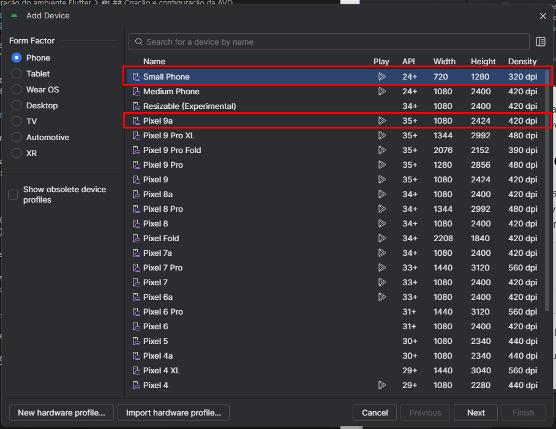

4. Ao selecionar o formato/tipo, clique em **Next** para acessar a janela de configuração da AVD. Nesta janela, você deverá selecionar a imagem do Android desejada para a máquina virtual. Ao final, clique em ***Finish***.

*Obs.: Caso a imagem não tenha sido baixada, será necessário clicar no ícone de download ⤓ ao lado de cada imagem antes de prosseguir.

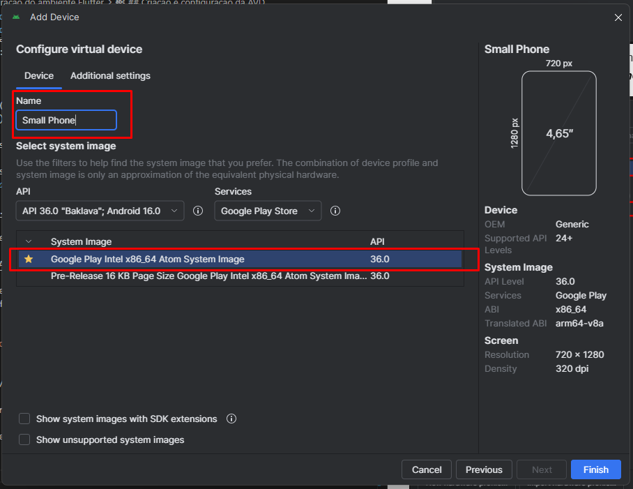


5. Após a criação da AVD, clique no botão ***Start*** para iniciar sua execução e verificar se está tudo funcionando corretamente.


Assim que a imagem for criada, execute os processo novamente para a AVD Pixel 9a, selecionando agora a imagem  do Android 9a.

---

## Instalação e configuração do Framework Flutter

O *Flutter* é o framework que será utilizado para o desenvolvimento das aplicações móveis multiplataforma. Ele é um framework de alto nível, e depende do SDK do Android para compilar e executar os projetos desenvolvidos.

1. Baixe o instalador manual do Flutter através deste link: [https://docs.flutter.dev/install/manual](https://docs.flutter.dev/install/manual).

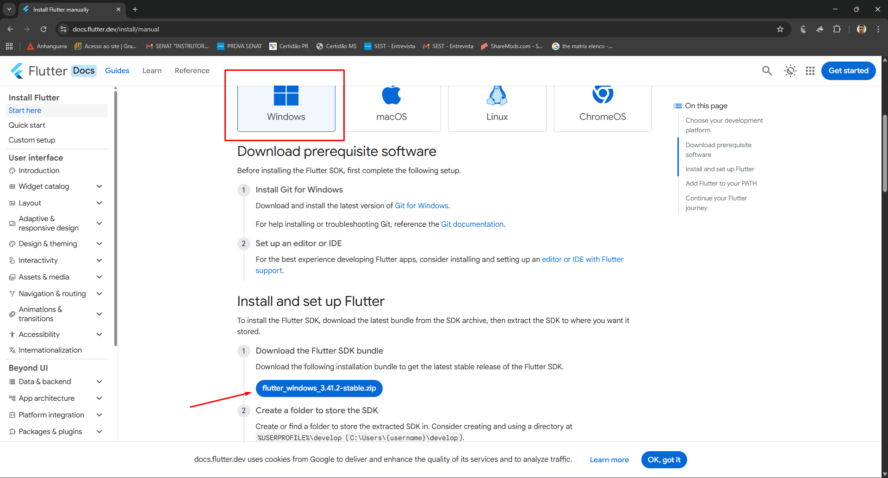

2. Após o download, extraia o conteúdo do arquivo para a pasta ***C:\flutter***.

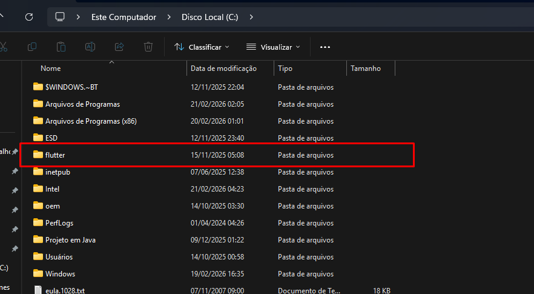

3. Acesse as Variáveis de Ambiente e, na variável ***Path*** da seção **Variáveis de Sistema**, adicione os caminhos ***C:\flutter*** e ***C:\flutter\bin*** referente aos binários de execução do framework.

*Obs.: Para abrir as variáveis de ambiente, abra o Executar (🪟 + R) e digite o comando sysdm.cpl. Por fim, acesse a aba Avançado e clique em variáveis de ambiente.*

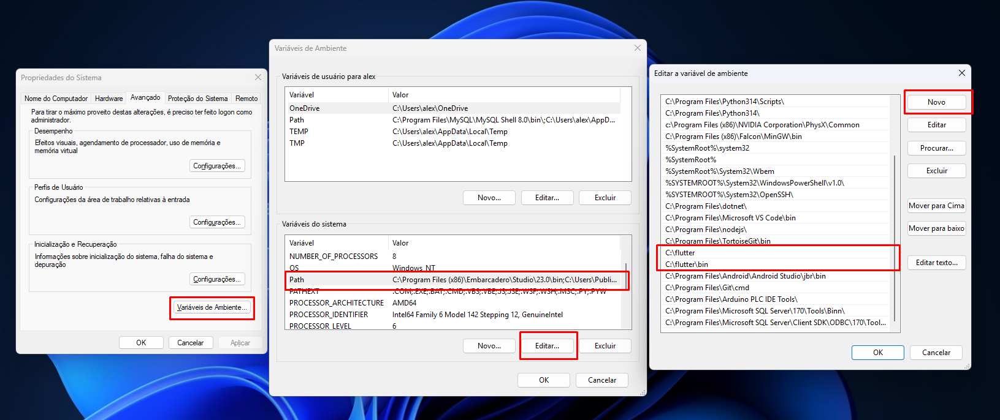

4. Abra o **Prompt de Comandos do Windows** (CMD) e digite o seguinte comando:

```bash
flutter doctor
```

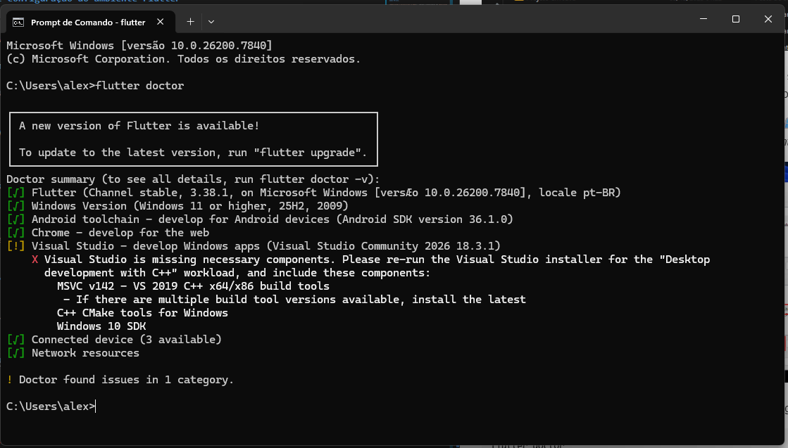

O comando irá listar os recursos que estão faltando e que já estejam instalados no computador.


5. Em seguida, execute o seguinte comando para abrir os termos de licença do Android SDK (principalmente do sdkmanager). Você precisa aceitar as licenças digitando y:

```bash
flutter doctor --android-licenses
```

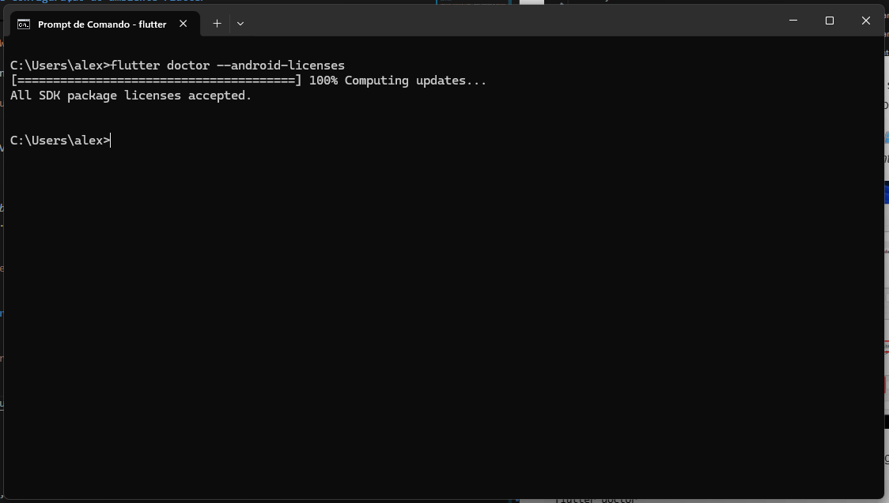


Feito isso, seguiremos para o último processo, o de instalação e configuração do Visutal Studio Code (VS Code)

---

## Instalação e configuração do Microsoft Visual Studio Code

Embora esse seja o processo mais simples a ser feito, é preciso se atentar aos detalhes da instalação. Para evitar problemas, recomenda-se o uso da versão ***System Installer*** para o Windows, cujo objetivo é permitir acesso a todos os recursos de sistema ao editor de código.

1. Baixe a versão ***System Installer*** o VS Code clicando neste link: [https://code.visualstudio.com/download](https://code.visualstudio.com/download)

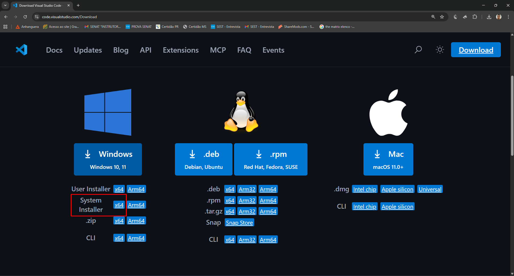

2. Execute o instalador e siga os passos da instalação com os valores padrão. Na seção **Selecionar Tarefas Adicionais**, habilite as opções **Adicione a ação "Abrir com Code" ao menu de contexto de arquivo do Windows Explorer** e **Registre Code como um editor para tipos de arquivos suportados**.

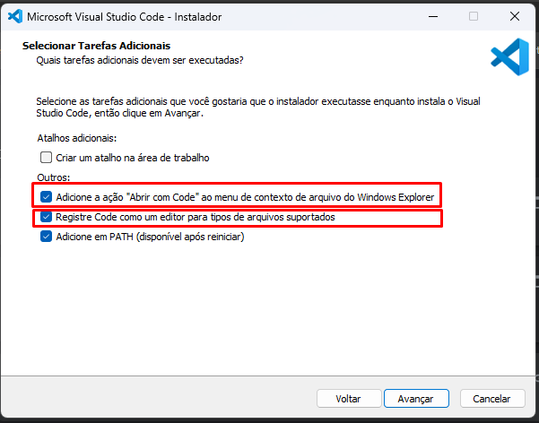

3. Finalize a instalação e abra o VS Code.

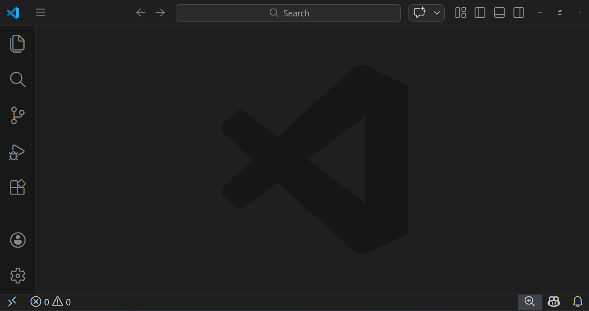

4. Em seguida, criaremos o perfil de programação para o Flutter. Esse perfil é necessário para separarmos as extensões referente a cada tecnologia que utilizamos para programar com o VS Code. Para isso, clique no ícone da engrenagem ⚙️, presente no canto inferior esquerdo do VS Code, e, em seguida, clique ***Profile ▶ Profiles***:

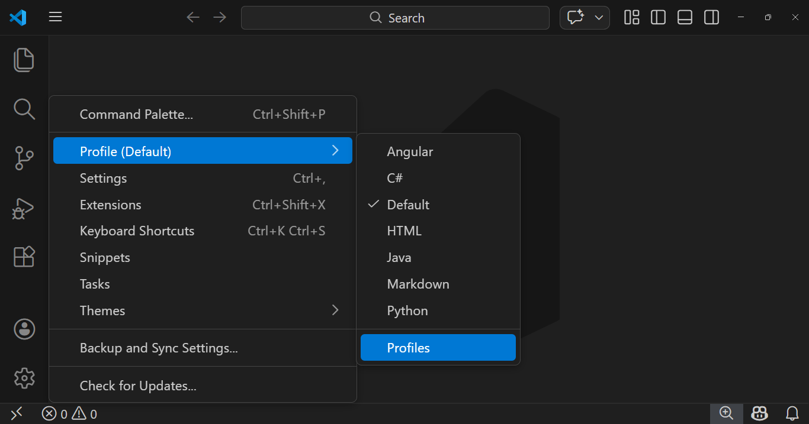

5. Na janela ***Profiles***, clique em ***New Profile*** e adicione um novo perfil. Escolha um nome, um ícone para ajudar na identificação e, por fim, clique em ***Create***. 

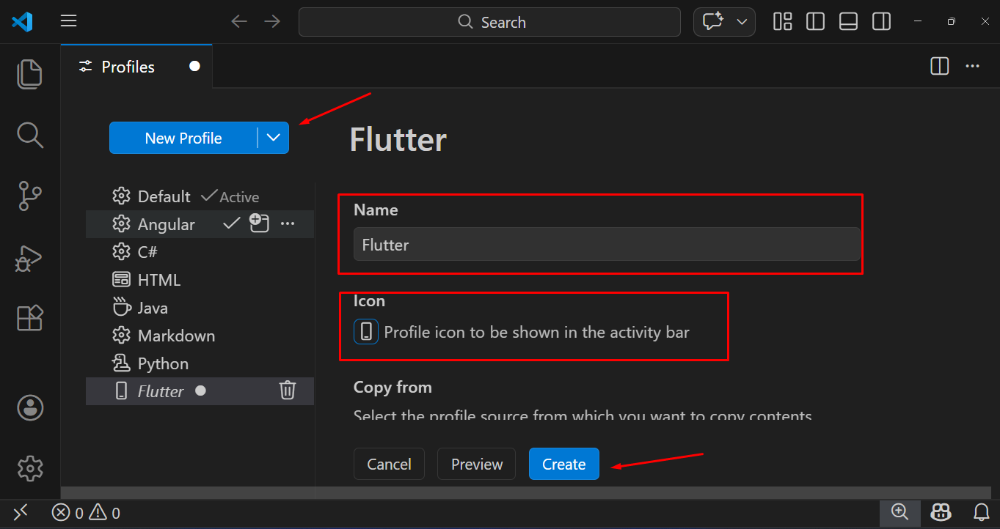

6. Antes de prosseguir, certifique-se de que o perfil criado é o que está selecionado. Caso ainda não esteja, clique novamente no ícone da engrenagem ⚙️, presente no canto inferior esquerdo do VS Code, e, em seguida, clique ***Profile ▶ Profiles***. Selecione o perfil criado no passo anterior.

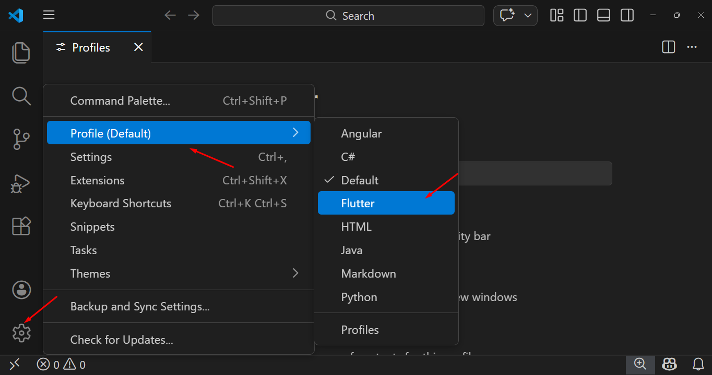

7. Como último passo importante, instalaremos a extensão  ***[Flutter](https://marketplace.visualstudio.com/items?itemName=Dart-Code.flutter)***, desenvolvido pela *Dart Code*. Para isso, clique no ícone **Extensions** (Ctrl + Shift + X) e busque por ***FLutter***. Clique no primeiro ícone encontrado e faça a instalação da extensão.

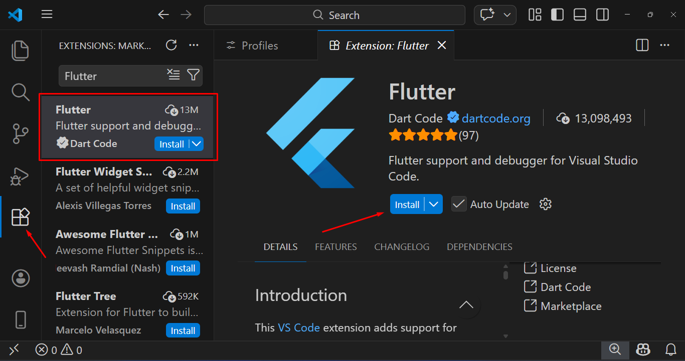

Após a conclusão da instalação e configuração do VS Code, poderemos então realizar o teste criando uma aplicação. Você poderá testar seguindo os passos da próxima seção.

---

## Testando um app em Flutter com VS Code

Com todas as etapas de instalação e configuração concluídas, resta-nos testar a execução de um app com o Microsoft VS Code.

1. Com o Microsoft VS Code aberto, e com o perfil Flutter selecionado, pressione as teclas ***Ctrl + Shift + P*** para abrir a palheta de comandos e digite ***>Flutter: New Project***. Por fim, pressione Enter.

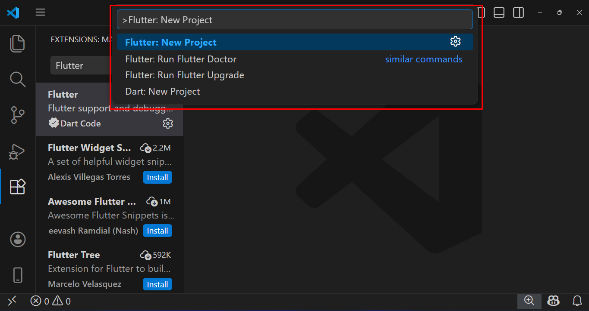

2. Em seguida, selecione a opção ***Application*** para criar um app de testes:

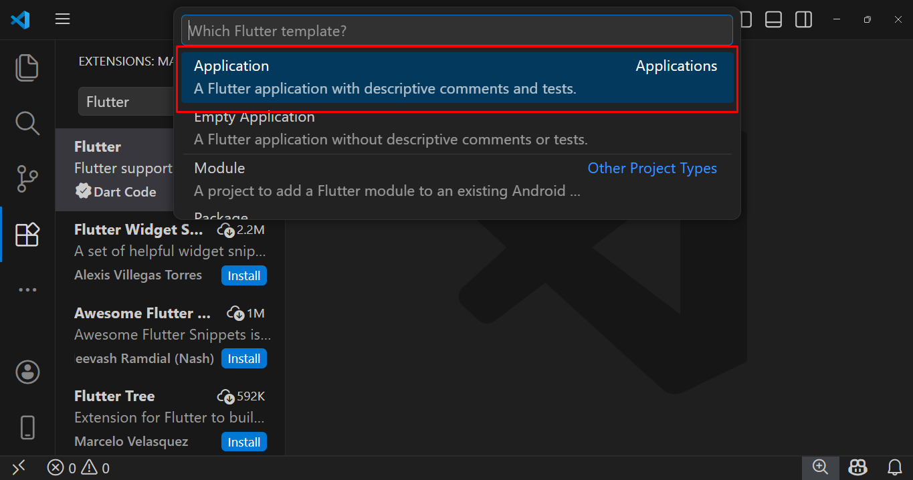

3. Selecione a pasta do computador onde será salvo os arquivos do projeto. Recomenda-se criar uma pasta para isso.

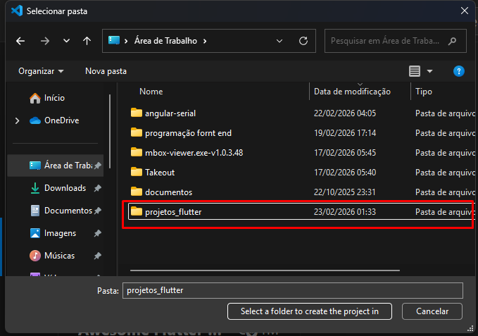

4. Dê um nome sugestivo ao projeto e pressione Enter.
*Obs.: recomenda-se utilizar o design pattern snake_case para nomear o projeto e seus arquivos*.

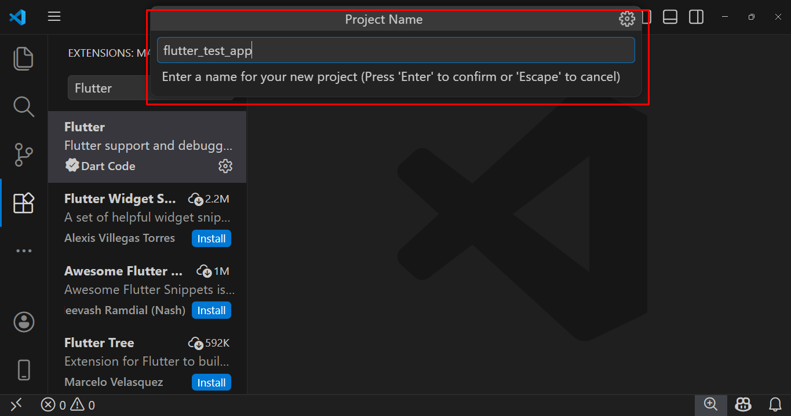

5. Após isso, o VS Code será recarregado, abrindo a pasta do projeto como contexto. A partir deste ponto, a extensão ***Flutter*** já reconheceu o projeto e já é possível executar o app.

6. Na barra de status do VS Code, presente na parte inferior da tela, no canto esquerdo, existe um item com a descrição ***No Device***. Este é o item responsável por vincular o projeto a uma forma de execução, podendo ser Web, um AVD ou simplesmente seu próprio dispositivo Android (desde que esteja devidamente configurado no ADB). Selecione a opção ***Start Small Phone***
*Obs.: existem duas opções com praticamente a mesma descrição, mudando apenas a segunda com a informação (cold boot). Esta última executa a AVD sem hibernação, resetando a inicialização da máquina.*

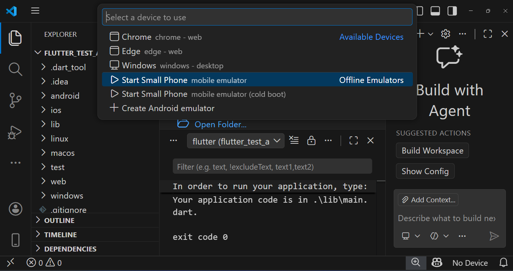

7. Ao clicar nesta opção, a AVD será instantaneamente iniciada. Aguarde alguns segundos até que a máquina conclua o BOOT.

8. Para testar a execução do app, abra o explorador de arquivos do VS Code e encontre o arquivo ***main.dart***, presente na pasta ***lib/***. Clique no arquivo e pressione o botão ***Start Debugging***, presente no canto superior direito da aba do arquivo.

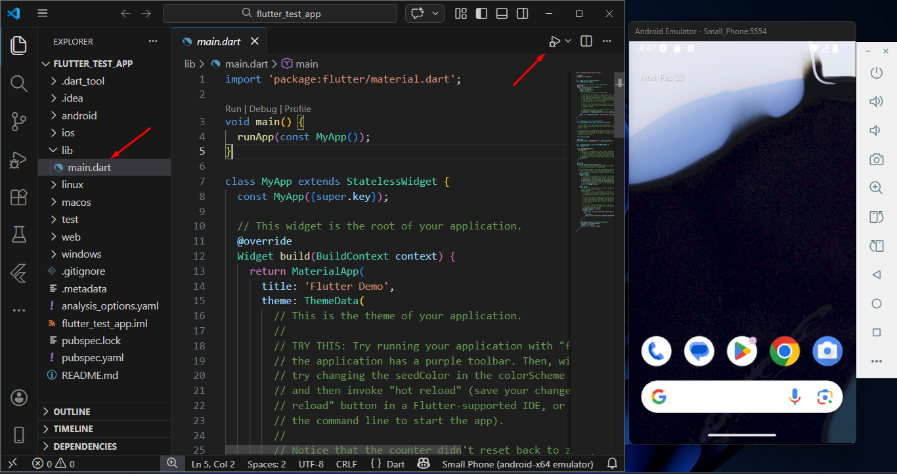

9. Aguarde alguns minutos até que o Flutter finalize a compilação do app e envie para a AVD. Quando finalizar, você poderá observar a execução do app na janela da AVD que está aberta.

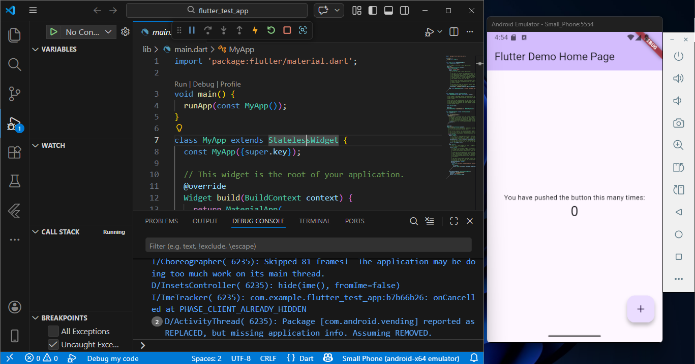

Com isso, finalizamos todo o processo de instalação, configuração e execução do ambiente Flutter.

---

Desenvolvido por [Alex Rocha](https://www.linkedin.com/in/alexdiegorocha/).